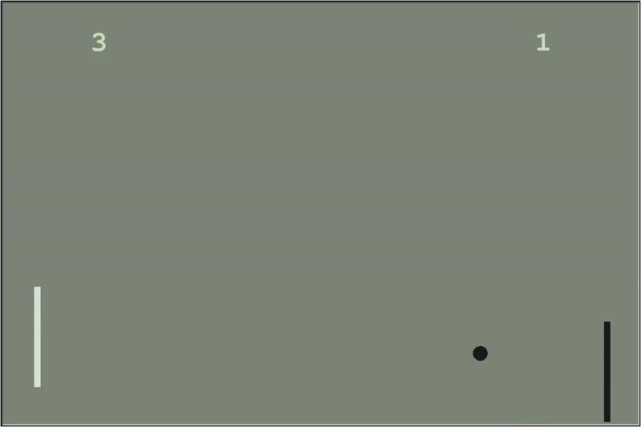

# pyPong

## About
A basic Pong game made in *pyhton3* using *Turtle Graphics.*



## How to run
  ( ! ) For some linux distros it may be needed to install the `tkinter` package:
```
sudo apt install python3-tk
```

***Play pyPong:*** 

`python3 pong.py`

## Made with
- Turtle Graphics

## License
MIT License
